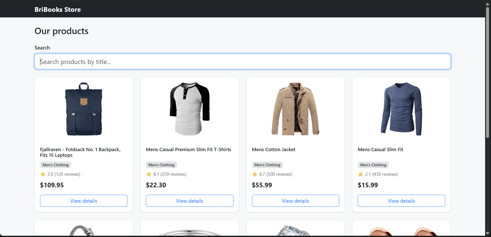
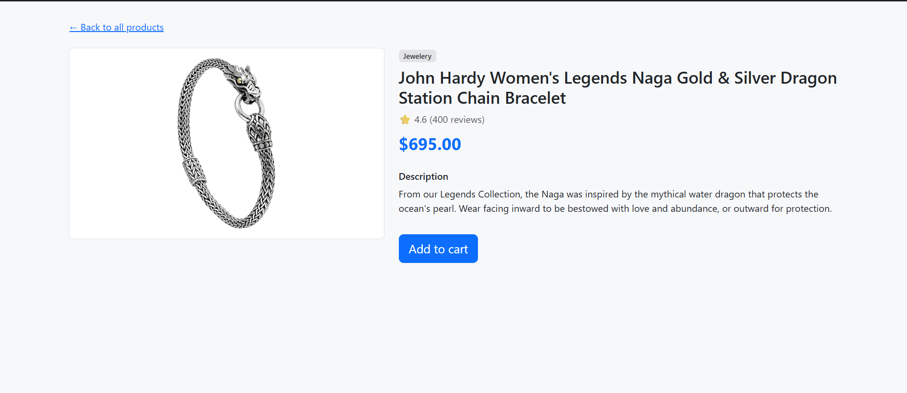
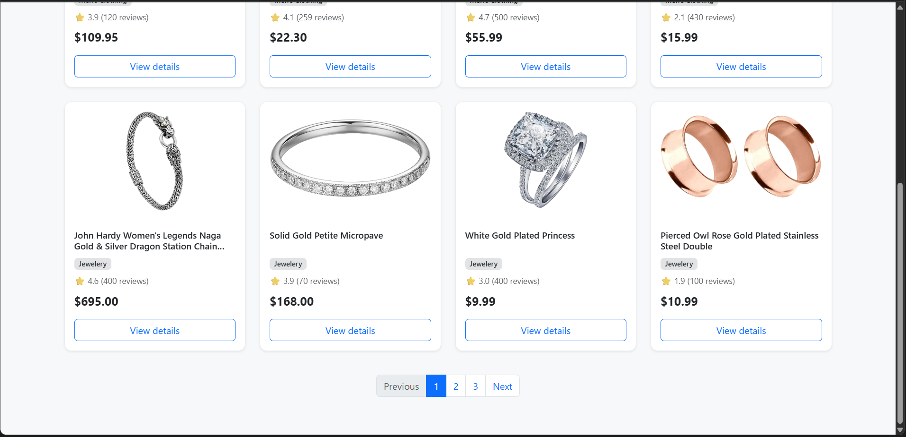

<h1 align="center">
🛍️ BriBooks Store
</h1>

<p align="center">
A <strong>responsive e-commerce product listing application</strong> built as part of the
<strong>BriBooks Frontend Intern Assignment</strong>.
</p>

<p align="center">
This project demonstrates <strong>Server-Side Rendering (SSR)</strong>, responsive UI development,
dynamic routing, reusable React components, client-side search & pagination,
TypeScript integration, and unit testing using modern frontend development practices.
</p>

<p align="center">


</p>

---

# 📑 Table of Contents

- [📸 Application Preview](#-application-preview)
- [✨ Key Features](#-key-features)
- [🛠️ Tech Stack](#️-tech-stack)
- [📁 Project Structure](#-project-structure)
- [🚀 Getting Started](#-getting-started)
- [📋 Assignment Requirements Checklist](#-assignment-requirements-checklist)
- [💡 Design Decisions & Assumptions](#-design-decisions--assumptions)
- [🧪 Testing](#-testing)
- [🌐 API Used](#-api-used)
- [🔗 Live Demo](#-live-demo)

---

# 📸 Application Preview

## 🏠 Home Page

<p align="center">

</p>

---

## 📄 Product Details

<p align="center">

</p>

---

## 📑 Pagination

<p align="center">

</p>

---

# ✨ Key Features

✅ **Server-Side Rendering (SSR)** using **`getServerSideProps`**

✅ **Responsive Product Grid** built with **Bootstrap 5**

✅ **Product Listing** fetched from the **Fake Store API**

✅ **Dynamic Product Details Page** using Next.js Dynamic Routing

✅ **Client-side Search** with **Loading Spinner**

✅ **Client-side Pagination**

✅ **Graceful API Error Handling**

✅ **Reusable React Components**

✅ **TypeScript** for type safety

✅ **Unit Testing** using Jest & React Testing Library

---

# 🛠️ Tech Stack

| Technology | Purpose |
|------------|----------|
| **Next.js 14 (Pages Router)** | Framework |
| **React 18.3** | UI Library |
| **TypeScript** | Type Safety |
| **Bootstrap 5** | Responsive Styling |
| **Fake Store API** | Product Data |
| **Fetch API** | Data Fetching |
| **Jest** | Unit Testing |
| **React Testing Library** | Component Testing |

---

# 📁 Project Structure

```text
.
├── components/
│   ├── Navbar.tsx
│   ├── ProductCard.tsx
│   ├── SearchBar.tsx
│   ├── Pagination.tsx
│   └── LoadingSpinner.tsx
│
├── pages/
│   ├── _app.tsx
│   ├── index.tsx
│   └── product/
│       └── [id].tsx
│
├── styles/
│   └── globals.css
│
├── types/
│   └── product.ts
│
├── __tests__/
│   ├── ProductCard.test.tsx
│   ├── SearchBar.test.tsx
│   └── Pagination.test.tsx
│
├── jest.config.js
├── jest.setup.js
└── README.md
```

---

# 🚀 Getting Started

## **1️⃣ Clone the Repository**

```bash
git clone https://github.com/Hrishisk99/bribooks-frontend-assignment.git
```

---

## **2️⃣ Navigate into the Project**

```bash
cd bribooks-frontend-assignment
```

---

## **3️⃣ Install Dependencies**

```bash
npm install
```

---

## **4️⃣ Start Development Server**

```bash
npm run dev
```

Visit:

```
http://localhost:3000
```

---

## **5️⃣ Build for Production**

```bash
npm run build
npm start
```

---

## **6️⃣ Run Unit Tests**

```bash
npm test
```

---

# 📋 Assignment Requirements Checklist

| Requirement | Status |
|-------------|:------:|
| **React.js** | ✅ |
| **Next.js** | ✅ |
| **Bootstrap 5** | ✅ |
| **Fetch Product API** | ✅ |
| **Responsive Product Grid** | ✅ |
| **Search Functionality** | ✅ |
| **Dynamic Product Details Page** | ✅ |
| **Pagination** | ✅ |
| **Loading Spinner** | ✅ |
| **Graceful Error Handling** | ✅ |
| **TypeScript (Bonus)** | ✅ |
| **Unit Testing (Bonus)** | ✅ |

---

# 💡 Design Decisions & Assumptions

### 🔍 Search Implementation

The **Fake Store API** returns the complete product catalog in a **single API request**.

Instead of issuing additional network requests while typing, the application performs **client-side filtering**, resulting in a smoother and faster user experience.

To clearly demonstrate the loading state requested in the assignment, a short **300ms artificial delay** is introduced before rendering filtered results.

---

### 📑 Pagination

Pagination is implemented entirely on the **client-side**, since all products are already available after the initial **SSR fetch**.

Each page displays **8 products**.

---

### ⭐ Product Rating

Ratings are rendered directly from the API response and displayed as:

- ⭐ Average Rating
- 📝 Review Count

---

### 🛒 Add to Cart

The **Add to Cart** button on the Product Details page is intentionally implemented as a **UI placeholder**.

Shopping cart functionality was **outside the scope** of the assignment.

---

### 🖼️ Images

Images are rendered using the native HTML **``** element.

This keeps the project lightweight while avoiding additional configuration for remote image optimization.

---

# 🧪 Testing

The following reusable components are covered with **unit tests**:

| Component | Status |
|-----------|:------:|
| **ProductCard** | ✅ |
| **SearchBar** | ✅ |
| **Pagination** | ✅ |

### Testing Framework

- **Jest**
- **React Testing Library**

---

# 🌐 API Used

**Fake Store API**

https://fakestoreapi.com/products

---

# 🔗 Live Demo

> **Not deployed.**

The project can be deployed directly on **Vercel** or **Netlify** with zero additional configuration.

---

# 👨‍💻 Developer Notes

This project focuses on demonstrating:

- **Server-Side Rendering (SSR)**
- **Modern React Development**
- **Reusable Component Architecture**
- **Responsive UI Design**
- **TypeScript Integration**
- **Dynamic Routing**
- **Client-side State Management**
- **Unit Testing Best Practices**

---

<p align="center">

Built with 🧠 using <strong>Next.js</strong>, <strong>React</strong>, <strong>TypeScript</strong>, and <strong>Bootstrap</strong>.

</p>